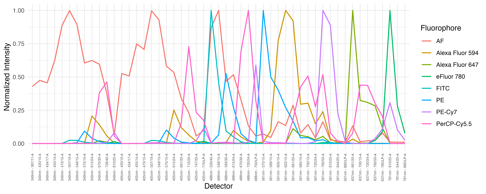
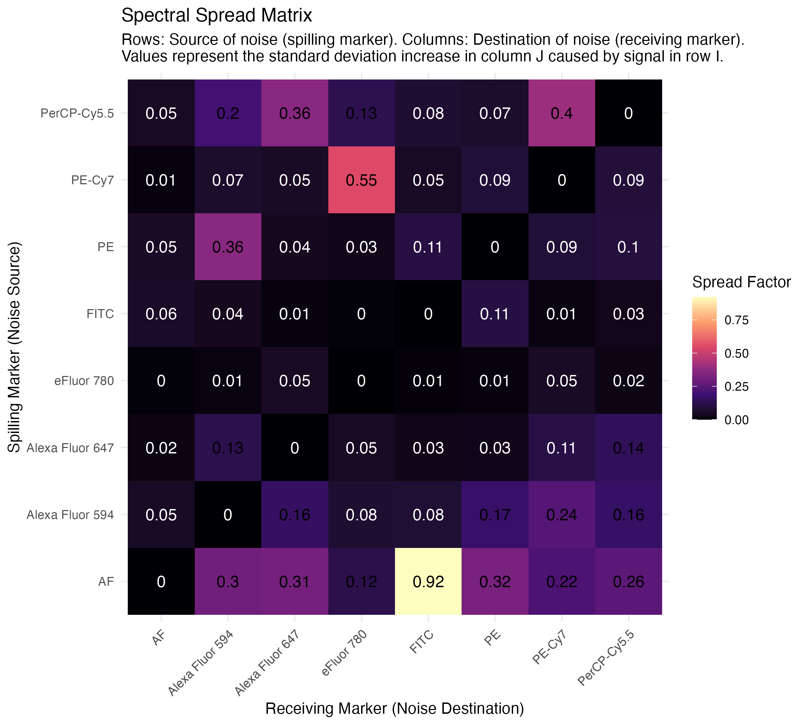
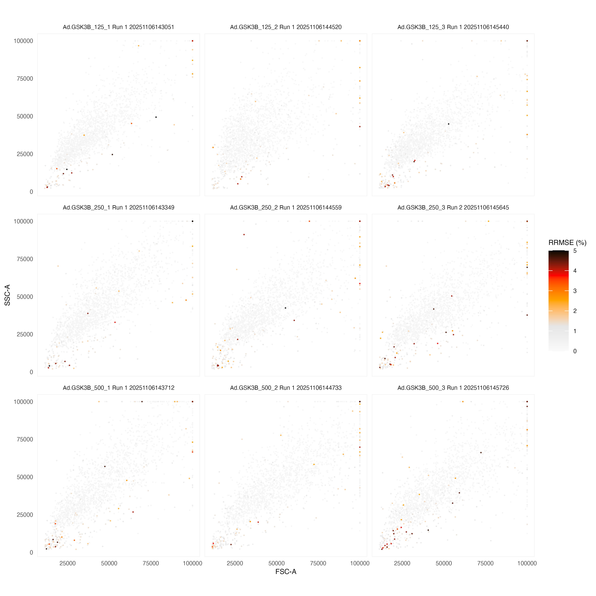
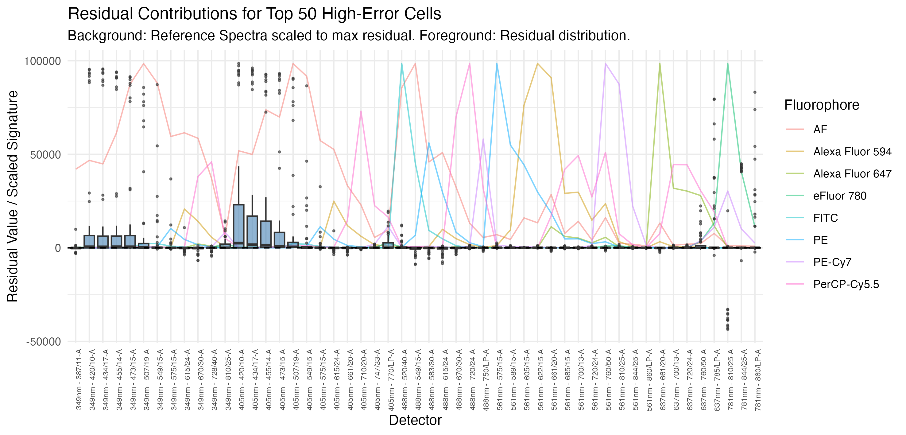

# spectrQC: Full Spectrum Flow Cytometry Quality Control

`spectrQC` is an R package designed to validate spectral unmixing accuracy by calculating and visualizing unmixing residuals. It provides a modular pipeline to isolate single-stained control spectra, refine them using spectral QC metrics, and unmix experimental data using industry-standard per-cell WLS models.

## Key Features
- **Automated Gating**: Isolate positive populations from beads or cells using Gaussian Mixture Models (GMM).
- **Internal Negative Subtraction**: Automatically isolate fluorophore signatures by subtracting internal background populations.
- **Spectral Refinement**: Tighten single-color control signatures by filtering out high-RRMSE events (debris/outliers).
- **Per-Cell WLS Unmixing**: High-accuracy unmixing using the photon-counting variance model ($\sigma^2 = \text{Signal} + \text{Background}$). 
- **Modular Audit Reports**: Dedicated PDF audits for both single-color controls and experimental samples.
- **Visual Diagnostics**: Individual PNG exports for every stage of the QC process.

---

## Installation

```r
# Install from GitHub
devtools::install_github("pkheisig/spectrQC")
```

---

## The Workflow

The `spectrQC` workflow is divided into four distinct phases.

### 1. Check Single Color Controls
Performs initial gating, extracts raw spectra, and generates a dedicated SCC audit report.

```r
library(spectrQC)

# Perform initial gating and signature extraction
M_initial <- inspect_scc_spectra(scc_dir = "scc", 
                                output_dir = "gating_and_spectrum_plots", 
                                control_file = "fcs_control_file.csv")

# Generate the SCC-only QC report (saved as PDF and individual PNGs)
generate_scc_report(M_initial, scc_dir = "scc", output_file = "SCC_Initial_Audit.pdf")
```

### 2. Refine SCCs (Cleaning)
Uses an RRMSE cutoff to remove debris and "tighten" the reference signatures. Produces the final Reference and Unmixing matrices.

```r
# Clean SCCs, produce W matrix, and generate Before/After comparison
refined <- refine_scc_matrix(M_initial, 
                            scc_dir = "scc", 
                            rrmse_threshold = 0.05, 
                            output_dir = "scc_unmixed")

M_final <- refined$M
W_final <- refined$W
```

### 3. Unmix Experimental Samples
Applies the refined signatures to your experimental data.

```r
# Unmix all files in 'samples/' folder using WLS
unmixed_list <- unmix_samples(sample_dir = "samples", 
                             M = M_final, 
                             method = "WLS", 
                             output_dir = "samples_unmixed")
```

### 4. QC Experimental Samples
Generates the final comprehensive audit for the unmixed samples.

```r
# Generate the professional PDF audit for experimental data
generate_sample_qc(unmixed_list, M = M_final, output_dir = "samples_unmixed_qc", report_file = "Experimental_Sample_Audit.pdf")
```

---

## Output Folders
`spectrQC` keeps your main directory clean by organizing outputs:
- `gating_and_spectrum_plots/`: Visual confirmation of initial SCC gating.
- `scc_unmixed/`: Refined signatures and unmixed control data.
- `samples_unmixed/`: Your final unmixed experimental data (CSV).
- `samples_unmixed_qc/`: High-resolution RRMSE scatters and residual diagnostics.
- `spectrQC_outputs/plots/`: Individual PNG versions of all report pages.

---

## Understanding the Audit Reports

The reports generated by `spectrQC` contain several key visualizations. Here is how to interpret them:

### 1. Reference Spectra Overlay
This plot shows the "fingerprint" of every fluorophore in your panel across all detectors.

- **What to look for**: Each line should represent a clean, logical spectral curve. 
- **Warning signs**: If a line is jagged or shows peaks in unexpected places, the initial gating of that control may have failed or the sample was contaminated.

### 2. Spectral Spread Matrix (SSM)
This matrix quantifies how much "noise" one fluorophore adds to another after unmixing.

- **What to look for**: **Dark colors (low values)** are ideal, indicating minimal interference. 
- **Warning signs**: **Light colors (high values)** indicate that two fluorophores have very similar spectra. This means you will lose sensitivity when trying to detect dim signals on cells that are also positive for the "spreading" fluorophore.

### 3. RRMSE Scatters (The "Heat" Map)
We plot FSC vs SSC for every sample, but color the cells by their **Relative Root Mean Square Error (RRMSE)**.

- **What it means**: RRMSE measures how well the unmixing algorithm "fits" the raw data. 
- **What to look for**: Most cells should be gray or light orange (RRMSE < 3-5%).
- **Warning signs**: Large clusters of red/black cells indicate that the unmixing model is failing for those populations. This is often caused by debris, autofluorescence mismatches, or missing markers in your reference matrix.

### 4. Residual Contributions (The "Fingerprint of Error")
This plot identifies exactly **which detectors** are causing the unmixing error for the "worst" cells in your sample.

- **What it means**: It subtracts the predicted signal (from your matrix) from the actual raw signal.
- **What to look for**: Small boxplots centered around zero.
- **Warning signs**: If you see large positive or negative spikes at specific detectors, it means there is a signal in your sample that is not accounted for in your reference matrix (e.g., a contaminant or an unlisted fluorophore).

### 5. Marker-RRMSE Correlations
These plots show the unmixed intensity of a specific marker on the X-axis and the RRMSE on the Y-axis.
- **What to look for**: A flat red line.
- **Warning signs**: A sharp upward trend (where error increases as the signal gets brighter) indicates that the spectral signature for that specific marker is incorrect or that the detector is becoming non-linear.

---
**Author**: Paul Heisig  
**Email**: p.k.s.heisig@amsterdamumc.nl
